# CTU Academic Task Manager - Scope Freeze and System Design

Date: March 18, 2026

## 1) Scope Decision (Post-Title Defense)

The approved system focus is now a **mobile-based academic task management application for students**.

### 1.1 Scope Inclusions (Student-Facing)
- Task creation, editing, completion, and prioritization.
- Deadline tracking and reminders.
- Academic planning views (`Today`, `Upcoming`, `Planner`).
- Course/class-aware task context.
- Announcements and exam preparation support.
- Profile and notification settings.

### 1.2 Scope Exclusions (Removed/Deprecated)
- Android device usage monitoring features.
- Usage-access prompts and app-usage insight UI.
- Study-time guard / usage-lock controls.

### 1.3 Scope Constraint
- **Do not change the student `Schedule` view behavior/flow in this scope update.**
- **Do not change admin `View Schedules` behavior/flow in this scope update.**

## 2) Architecture Overview

- Client: Expo React Native app using Expo Router for role-based navigation.
- Backend: Firebase Auth + Firestore.
- Local: AsyncStorage caching and offline queueing.
- Notifications: Expo Notifications for class/task/announcement reminders.

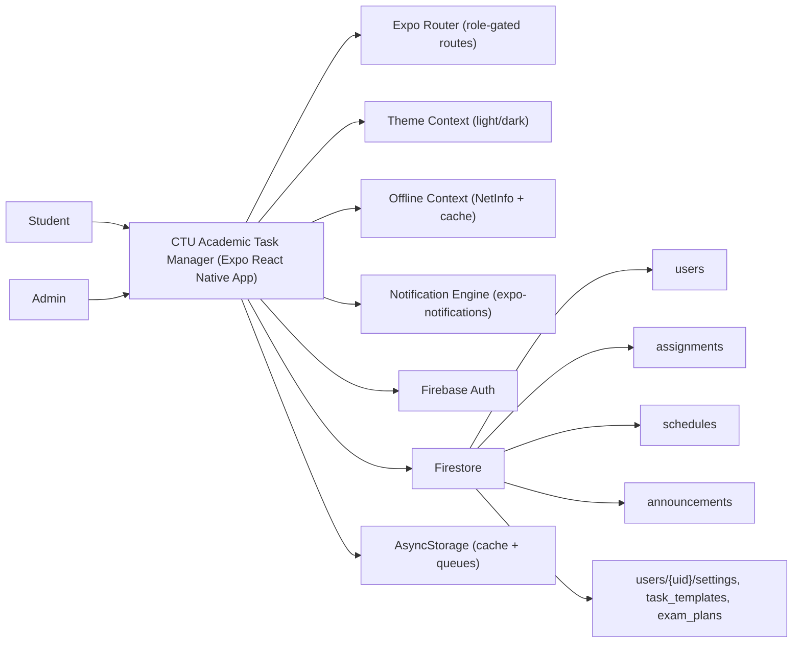

## 3) Core Data Entities (Firestore)

- `users/{uid}`
  - Fields: `fullName`, `email`, `role`, `photoBase64`, `studentInfo`.
- `assignments/{id}`
  - Fields: `userId`, `title`, `subject`, `dueAt`, `completed`, `type`, `priority`, `createdAt`.
- `schedules/{id}`
  - Fields: `course`, `year`, `section`, `semester`, `scheduleType`, `weekSchedule`.
- `announcements/{id}`
  - Fields: `title`, `message`, `audience`, `college`, `course`, `year`, `section`, `imageBase64`, `createdAt`, `createdBy`.
- Subcollections:
  - `users/{uid}/task_templates/{id}`
  - `users/{uid}/exam_plans/{examId}`
  - `users/{uid}/settings/notification`

## 4) Process Flow

## 5) Navigation Map (Current)

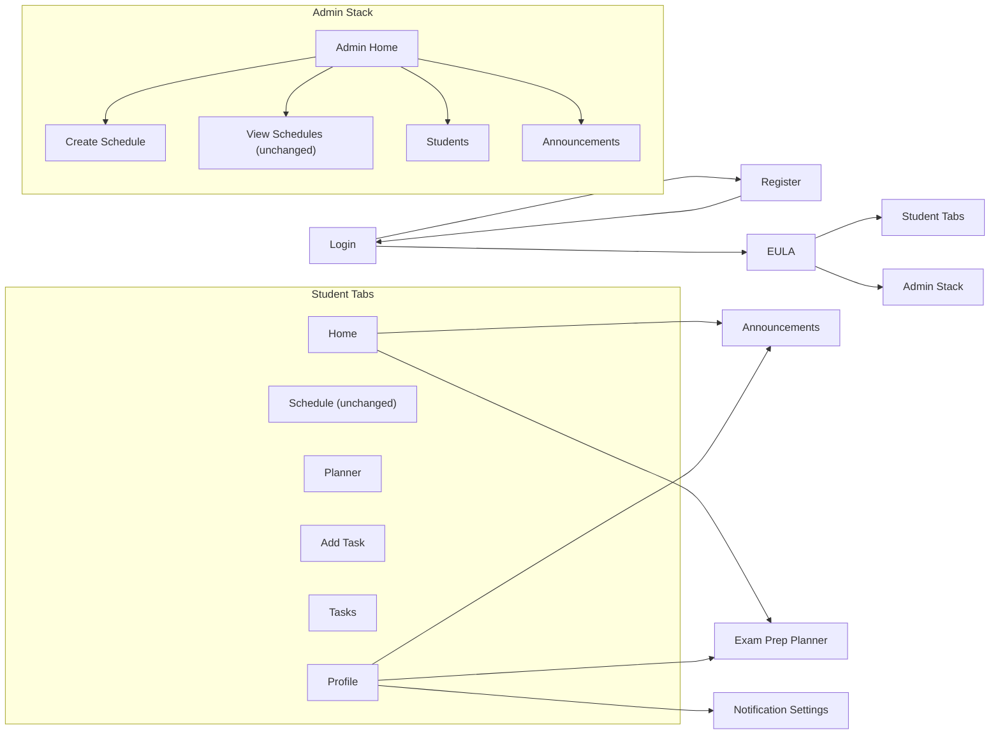

## 6) Screen Summary

### 6.1 Student
- Login/Register: authentication + EULA gating.
- Home: today classes, tasks, announcements, exam plans.
- Schedule: weekly class grid (unchanged).
- Planner: day/week/month planning + analytics.
- Add Task: task creation with type, priority, and due date.
- Tasks: pending + completed task list.
- Exam Prep Planner: study sessions and progress tracking.
- Profile: stats, profile updates, quick links.

### 6.2 Admin
- Admin Home: stats and quick actions.
- Create Schedule: weekly schedule builder.
- View Schedules: manage and edit schedules (unchanged).
- Students: grouped student listings.
- Announcements: create and manage announcements.

## 7) Mockups

- Login: `docs/mockups/login.svg`
- Student Home: `docs/mockups/home.svg`
- Schedule: `docs/mockups/schedule.svg`
- Planner: `docs/mockups/planner.svg`
- Add Task: `docs/mockups/add-task.svg`
- Admin Home: `docs/mockups/admin-home.svg`

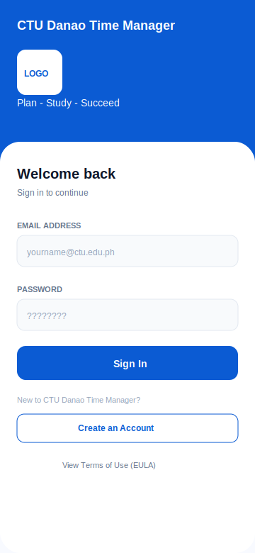
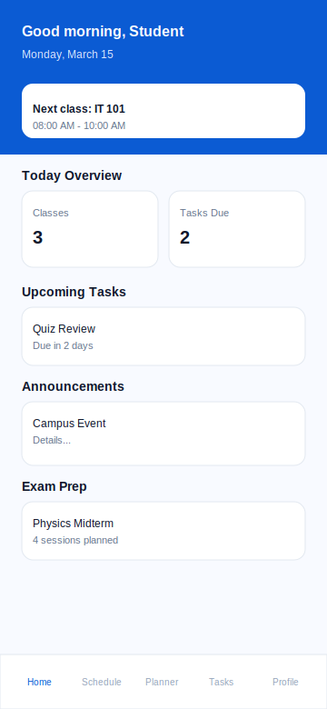
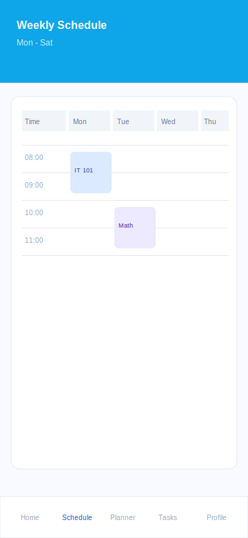
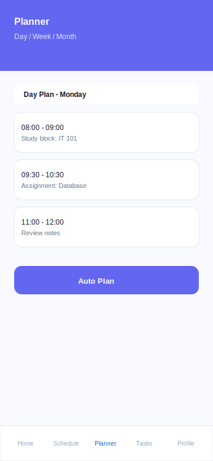
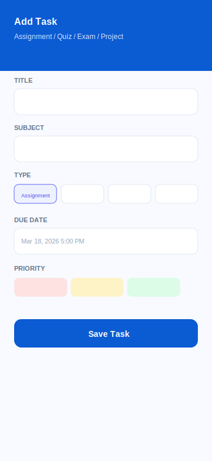
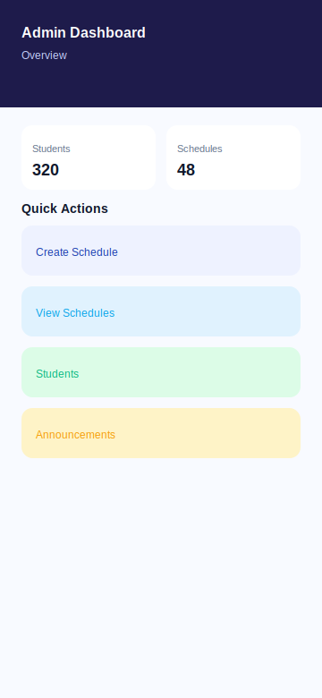
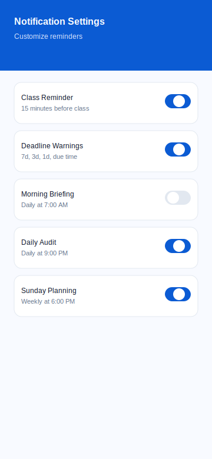
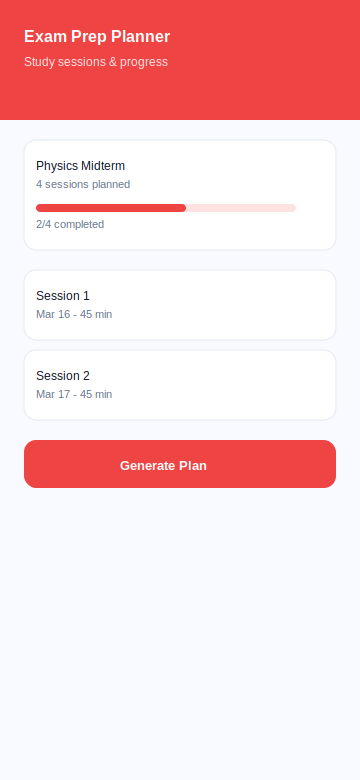
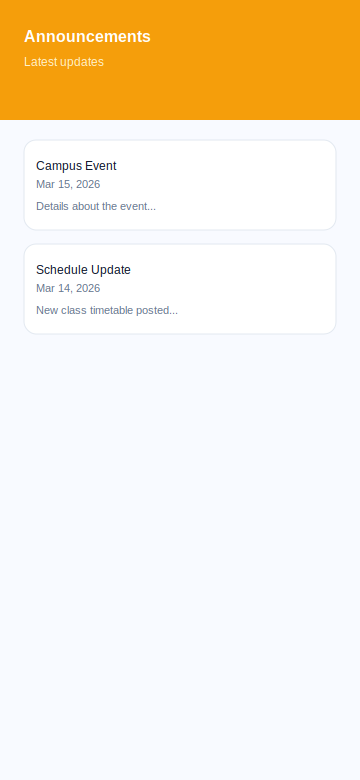
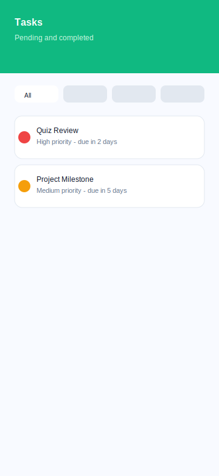
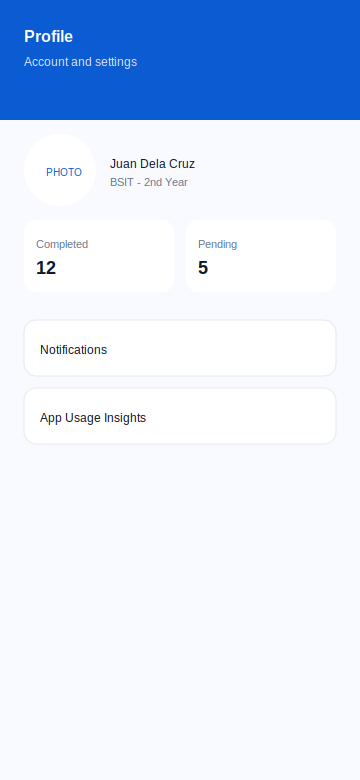
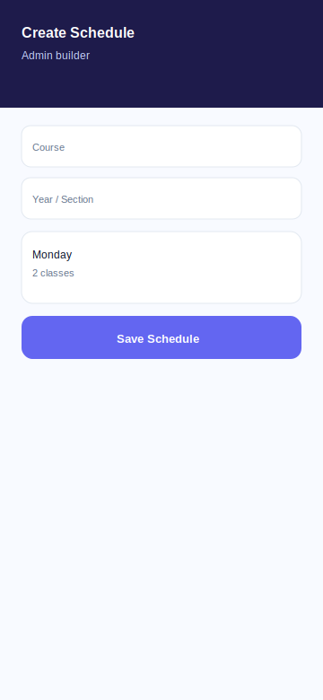
