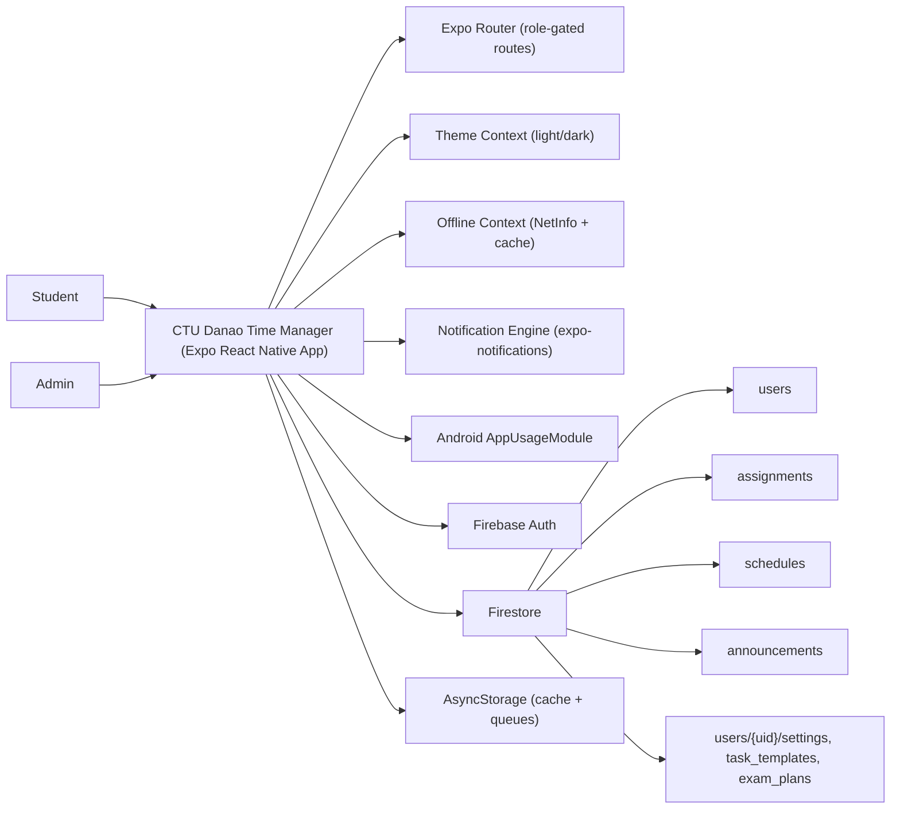
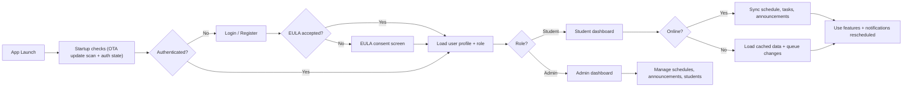
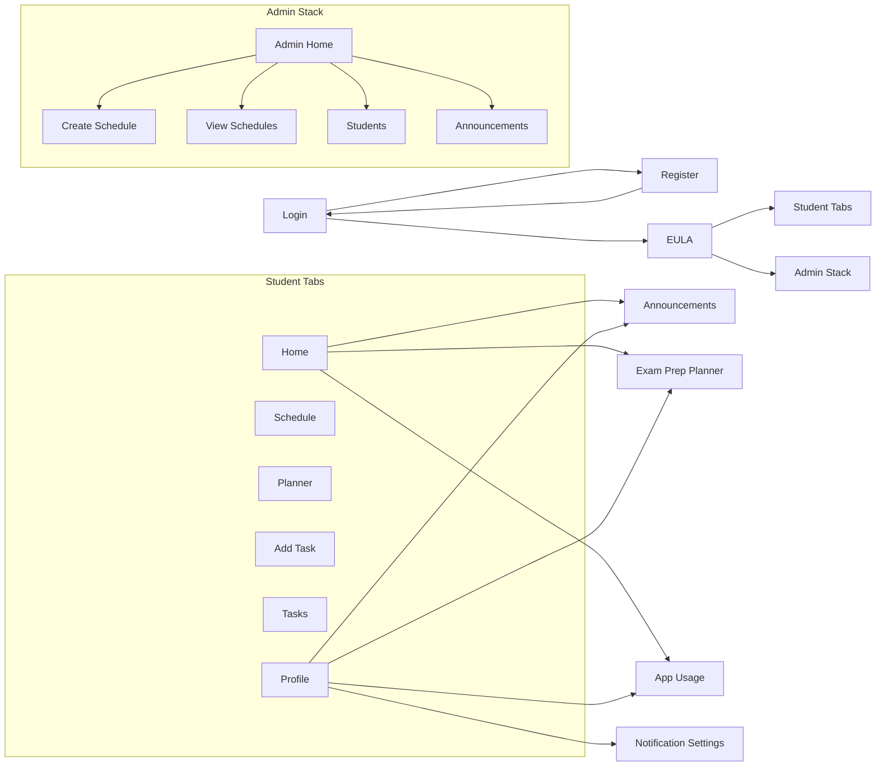

# CTU Danao Time Manager - System Design Documentation

Date: March 15, 2026

## 1) Output / System Design

### 1.1 Architecture Overview
- Client: Expo React Native app using Expo Router for navigation.
- Backend: Firebase Auth for authentication and Firestore for data storage.
- Local: AsyncStorage for caching and offline queues.
- Notifications: Expo Notifications (scheduled reminders and announcements).
- Device Usage: Android AppUsageModule for usage insights (Android only).

### 1.2 Core Data Entities (Firestore)
- `users/{uid}`
  - Fields: `fullName`, `email`, `role`, `photoBase64`, `studentInfo`.
  - Used by: role routing, schedules, announcements filtering, profile.
- `assignments/{id}`
  - Fields: `userId`, `title`, `subject`, `dueAt`, `completed`, `type`, `priority`, `createdAt`.
- `schedules/{id}`
  - Fields: `course`, `year`, `section`, `semester`, `scheduleType`, `weekSchedule`.
- `announcements/{id}`
  - Fields: `title`, `message`, `audience`, `college`, `course`, `year`, `section`, `imageBase64`, `createdAt`, `createdBy`.
- Subcollections:
  - `users/{uid}/task_templates/{id}`
  - `users/{uid}/exam_plans/{examId}`
  - `users/{uid}/settings/notification`

### 1.3 Offline Strategy
- Cached data per user: schedule, assignments, announcements, profile.
- Offline queues:
  - New assignments (create queue)
  - Task completion (update queue)
- On reconnection, queued changes are synced to Firestore.

### 1.4 Notifications
- Scheduled notifications:
  - Class reminders
  - Deadline warnings
  - Morning briefing
  - Daily audit
  - Sunday planning
  - Break reminder and app usage checks (Android)
- Notification settings sync to Firestore for cross-device continuity.

## 2) Process Flowchart

## 3) System User Interface

### 3.1 Navigation Map

### 3.2 Screen Summary (Student)
- Login/Register: authentication + EULA gating.
- Home: today classes, tasks, announcements, exam plans, usage summary.
- Schedule: weekly grid by day/time.
- Planner: day/week/month planning + analytics.
- Add Task: task creation with type, priority, and due date.
- Tasks: list of pending + completed tasks.
- Exam Prep Planner: study sessions and progress tracking.
- App Usage: device usage insights (Android).
- Profile: stats, profile updates, quick links.

### 3.3 Screen Summary (Admin)
- Admin Home: stats and quick actions.
- Create Schedule: weekly schedule builder.
- View Schedules: manage and edit schedules.
- Students: grouped student listings.
- Announcements: create and manage announcements.

## 4) Mockups Based on Code

These are simplified wireframes derived from the implemented UI layouts.

- Login: `docs/mockups/login.svg`
- Student Home: `docs/mockups/home.svg`
- Schedule: `docs/mockups/schedule.svg`
- Planner: `docs/mockups/planner.svg`
- Add Task: `docs/mockups/add-task.svg`
- Admin Home: `docs/mockups/admin-home.svg`

Embedded previews (if supported by your viewer):

\n

